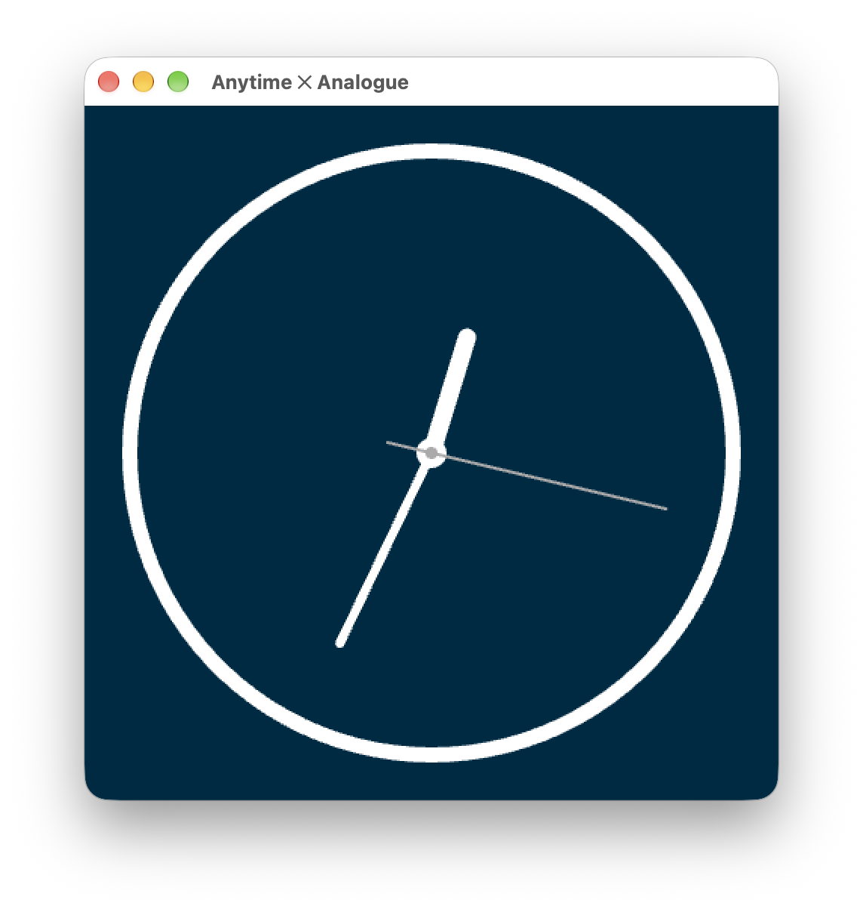

# Anytime Clocks

Collection of clocks for use with [Anytime](https://anytime.world)

## Overview

I've built a number of hardware clocks over the years that integrate with the Anytime web service. This repository is an attempt to collect them together into one place in advance of fully open sourcing Anytime itself.

## Anytime ✕ Analogue

Circular-faced clock built around the [Raspberry Pi Zero 2 W](https://www.raspberrypi.com/products/raspberry-pi-zero-2-w/) and the [Pimoroni HyperPixel 2.1 Round](https://shop.pimoroni.com/products/hyperpixel-round).

The clock runs Raspberry Pi OS with a small front-end service written in Rust and raylib that provides device management and displays the time.

## License

Anytime Clocks and all components are licensed under the MIT License (see [LICENSE](LICENSE)).
